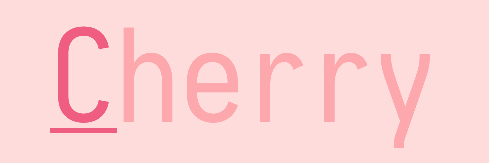

# Available Styles and Color Schemes

The project's structure enables anyone to easily create new styles and color schemes, allowing the application to quickly gain diversity.

## Available styles

#### Style 1 - First letters underlined

## Available color schemes

#### Color scheme 1 - adi1090x's color scheme

#### Color scheme 2 - Cherry

#### Color scheme 3 - Midnight Abyss

